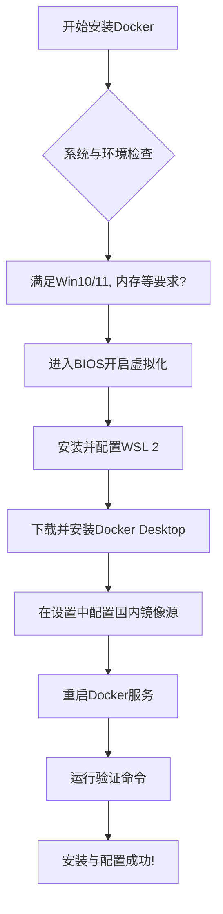

# AI交易策略系统部署与开发指南

## 1. 快速部署部分

### 1.1 概述

本指南提供AI交易策略系统的快速部署方法，适合熟悉Docker和容器化部署的用户。通过Docker Compose，您可以在5分钟内完成系统部署，包括后端服务、前端服务和数据库。

### 1.2 环境要求

- **Docker**: 20.10.0+ 
- **Docker Compose**: 2.0.0+ 
- **硬件**: 2核CPU, 4GB内存, 20GB磁盘空间
- **网络**: 能够访问Docker Hub（或配置了国内镜像加速器）

### 1.3 快速部署步骤

#### 1.3.1 克隆仓库

```bash
git clone <仓库地址>
cd backtesting_tool
```

#### 1.3.2 配置环境变量

```bash
# 复制默认配置文件
cp cfg/.env.sqlite .env

# 编辑配置文件（可选）
# 您可以根据需要修改配置，如数据库连接、API端口等
# vim cfg/.env
```

#### 1.3.3 启动服务

```bash
# 启动服务
docker-compose up -d
```

#### 1.3.4 验证服务

服务启动后，您可以通过以下地址访问系统：

| 服务类型       | 访问地址                     | 说明                                  |
|----------------|------------------------------|---------------------------------------|
| 前端应用       | http://localhost:5173        | 主应用界面                            |
| API文档        | http://localhost:8000/docs   | Swagger UI文档                        |
| 健康检查       | http://localhost:8000/health | 服务健康检查端点                      |
| 系统状态       | http://localhost:8000/       | 系统状态信息                          |

验证服务是否正常运行：

```bash
# 检查服务状态
docker-compose ps

# 检查健康状态
curl http://localhost:8000/health
```

### 1.4 Docker Compose配置说明

#### 1.4.1 配置文件

| 配置文件                     | 用途                          |
|------------------------------|-------------------------------|
| `docker-compose.yml`         | 本地环境配置                  |

#### 1.4.2 服务组成

| 服务名称      | 容器名称         | 端口映射          | 说明                          |
|---------------|------------------|-------------------|-------------------------------|
| backend       | ai-trading-backend | 8000:8000        | 后端服务（FastAPI）           |
| frontend      | ai-trading-frontend | 5173:5173        | 前端服务（React）             |


### 1.5 环境变量配置

#### 1.5.1 核心环境变量

| 环境变量名               | 描述                          | 默认值                                |
|--------------------------|-------------------------------|---------------------------------------|
| `database_url`           | 数据库连接URL                 | sqlite:///./db/backtesting_dev.db |
| `api_host`               | API服务监听地址               | 127.0.0.1                             |
| `api_port`               | API服务监听端口               | 8000                                  |
| `log_level`              | 日志级别                      | INFO                                  |
| `VITE_API_BASE_URL`      | 前端API基础URL                | http://localhost:8000                 |

### 1.6 服务管理

#### 1.6.1 启动服务

```bash
docker-compose up -d
```

#### 1.6.2 停止服务

```bash
docker-compose down
```

#### 1.6.3 重启服务

```bash
docker-compose restart
```

#### 1.6.4 查看服务状态

```bash
docker-compose ps
```

#### 1.6.5 查看服务日志

```bash
# 查看所有服务日志
docker-compose logs -f

# 查看特定服务日志
docker-compose logs -f backend
```

### 1.7 常见问题

#### 1.7.1 端口被占用

**问题**：启动服务时提示端口被占用。

**解决方案**：
1. 修改docker-compose配置文件中的端口映射，例如将8000端口映射到8001：
   ```yaml
   ports:
     - "8001:8000"
   ```
2. 或者停止占用端口的进程。

#### 1.7.2 镜像拉取失败

**问题**：无法拉取Docker镜像。

**解决方案**：
1. 配置Docker国内镜像加速器（参考2.3.3.5节）。
2. 检查网络连接，确保能够访问Docker Hub。
3. 使用代理服务器拉取镜像。

#### 1.7.3 服务启动后无法访问

**问题**：服务已启动，但无法通过浏览器访问。

**解决方案**：
1. 检查服务状态，确保所有服务都在运行：
   ```bash
   docker-compose -f docker-compose.local.yml ps
   ```
2. 检查防火墙设置，确保端口已开放。
3. 检查配置文件中的`cors_allow_origins`设置，确保允许您的访问来源。

#### 1.7.4 数据库连接失败

**问题**：后端服务无法连接到数据库。

**解决方案**：
1. 检查配置文件中的`database_url`是否正确。
2. 确保后端服务有写入数据库文件的权限。

## 2. 开发测试部署部分

### 2.1 项目概述

AI交易策略系统是基于FastAPI和SQLModel构建的智能交易策略执行系统，集成本地AI决策和远程策略服务，支持多市场、多策略的虚拟交易。

#### 2.1.1 核心功能
- 🤖 **AI智能决策**: 集成本地AI决策引擎，支持多种交易策略
- 📊 **虚拟账户管理**: 支持多个虚拟交易账户，实时跟踪资产变化
- 🔄 **自动化执行**: 定时执行交易策略，支持手动触发
- 🌐 **远程策略集成**: 对接远程策略API，获取专业交易建议
- 📈 **实时监控**: 提供完整的交易历史和账户快照
- 🛡️ **风险控制**: 内置风险评估和资金管理机制
- 📱 **现代化UI**: 基于React 18和Ant Design构建的响应式前端界面

#### 2.1.2 部署架构

```
┌─────────────────────────────────────────────────────────────────┐
│                       客户端浏览器                               │
└─────────────┬───────────────────────────────────────────────────┘
              │
┌─────────────▼─────────────┐   ┌─────────────────────────────────┐
│       前端服务 (React)     │   │        API文档 (Swagger)        │
│       端口: 5173          │   │       访问地址: /docs           │
└─────────────┬─────────────┘   └─────────────────────────────────┘
              │
┌─────────────▼─────────────┐
│       后端服务 (FastAPI)   │
│       端口: 8000          │
└─────────────┬─────────────┘
              │
┌─────────────▼─────────────┐
│      数据库服务 (SQLite) │
│       文件: backtesting_dev.db          │
└───────────────────────────┘
```

### 2.2 技术栈

#### 2.2.1 后端技术栈
- **FastAPI**: 现代化的Python Web框架
- **SQLModel**: 类型安全的ORM框架
- **SQLite**: 关系型数据库
- **Pydantic**: 数据验证和序列化
- **APScheduler**: 任务调度
- **HTTPX**: 异步HTTP客户端
- **Uvicorn**: ASGI服务器

#### 2.2.2 前端技术栈
- **React 18**: 现代化的JavaScript UI库
- **TypeScript**: 类型安全的JavaScript超集
- **Ant Design 5**: 企业级UI组件库
- **Vite**: 下一代前端构建工具
- **React Router DOM**: 路由管理
- **Axios**: HTTP客户端
- **Zustand**: 轻量级状态管理库
- **ECharts**: 强大的图表库

#### 2.2.3 基础设施依赖
- **Python 3.12+**: 后端运行环境
- **Node.js 18+**: 前端开发和构建环境
- **pnpm 8+**: 前端依赖管理
- **SQLite**: 数据库服务

### 2.3 环境准备

#### 2.3.1 硬件要求
- **CPU**: 2核及以上
- **内存**: 4GB及以上
- **磁盘空间**: 20GB及以上

#### 2.3.2 软件要求

| 软件          | 版本要求  | 用途                          |
|---------------|-----------|-------------------------------|
| Python        | 3.12+     | 后端运行环境                  |
| SQLite        | 内置       | 数据库服务                    |
| Node.js       | 18+       | 前端开发和构建环境            |
| pnpm          | 8+        | 前端依赖管理                  |
| Git           | 2.0+      | 版本控制                      |
| Docker        | 20.10.0+  | 容器化运行环境                |
| Docker Compose| 2.0.0+    | 多容器编排工具                |

#### 2.3.3 软件安装指南

##### 2.3.3.1 Python安装
- 访问 [Python官网](https://www.python.org/downloads/) 下载并安装Python 3.12+ 
- 安装完成后，验证安装：
  ```bash
  python --version
  pip --version
  ```

##### 2.3.3.2 Node.js和pnpm安装
- 访问 [Node.js官网](https://nodejs.org/) 下载并安装Node.js 18+ 
- 安装完成后，验证安装：
  ```bash
  node --version
  npm --version
  ```
- 安装pnpm：
  ```bash
  npm install -g pnpm
  pnpm --version
  ```

##### 2.3.3.3 Docker安装

Docker是一个开源的应用容器引擎，用于创建和运行容器化应用。

###### Windows平台

## 第一部分：核心概念与准备

在开始安装前，请了解两个核心概念：
*   **Docker Desktop**：这是你在 Windows 上使用的 Docker 图形化管理工具和引擎。
*   **WSL 2**：这是 Docker Desktop 在 Windows 上高效运行所必需的底层 Linux 环境。你需要先安装它。

下图清晰地展示了完整的安装、配置及验证流程，你可以先对整个步骤有一个全局的了解：



接下来，我们进入每一步的详细操作。

### 第1步：系统与BIOS检查（安装成功的关键）

#### 1.1 检查Windows版本
1.  按下键盘上的 `Win` + `R` 键。
2.  在弹出的“运行”窗口中输入 **`winver`**，然后按回车。
3.  确保你的系统是 **64位** 的 **Windows 10 版本 2004（内部版本 19041）或更高**，或者是 **Windows 11**。

#### 1.2 开启BIOS虚拟化支持（非常重要！）
此步骤是让 Docker 能够运行的基础，很多安装失败都源于此。
1.  **重启你的电脑**。
2.  在开机时，连续快速按下键盘上的 **`F2`、`F10`、`F12`、`Del` 或 `Esc`** 键（具体按键取决于电脑品牌，可搜索“你的电脑品牌+进入BIOS”确认）。
3.  进入BIOS设置界面后，使用方向键找到 **“Virtualization Technology (VT-x/AMD-V)”**、**“SVM Mode”** 或包含 “Virtualization” 字样的选项。
4.  将其状态从 **`Disabled`（禁用）** 更改为 **`Enabled`（启用）**。
5.  按下 `F10` 键（通常是保存并退出的快捷键），选择 **“Yes”**，电脑将自动重启。

### 第2步：安装 WSL 2 环境

WSL 2 是 Docker Desktop 在 Windows 上的运行基石。

1.  **以管理员身份打开 PowerShell**：
    *   在 Windows 搜索栏输入 “**PowerShell**”。
    *   在搜索结果中，右键单击 **“Windows PowerShell”** 或 **“终端”**，选择 **“以管理员身份运行”**。

2.  **执行一键安装命令**：
    在打开的蓝色 PowerShell 窗口中，**复制并粘贴**以下命令，然后按回车键：
    ```powershell
    wsl --install
    ```
    *   此命令会默认安装 Ubuntu 发行版和 WSL 2 内核。
    *   安装过程可能需要几分钟，并可能要求你重启电脑，请按照提示操作。

3.  **设置 Linux 用户名和密码**：
    *   电脑重启后，或在开始菜单中找到并打开 **“Ubuntu”**。
    *   首次启动会进行初始化，系统会提示你**创建一个新的 UNIX 用户名和密码**（这个账号独立于你的 Windows 账号，请务必记住）。

4.  **（可选）验证 WSL 版本**：
    再次以管理员身份打开 PowerShell，输入以下命令检查版本：
    ```powershell
    wsl -l -v
    ```
    确保 `VERSION` 列显示为 **2**。如果为 1，请运行 `wsl --set-default-version 2` 进行设置。

### 第3步：安装 Docker Desktop

1.  **下载安装程序**：
    访问 Docker 官网的下载页面，获取 **Docker Desktop for Windows** 安装包。

2.  **运行安装程序**：
    *   双击下载好的 `Docker Desktop Installer.exe`。
    *   在安装向导中，**务必勾选 “Use WSL 2 instead of Hyper-V”** 选项（这是我们安装 WSL 2 的目的）。
    *   跟随向导完成安装，最后点击 **“Close and restart”** 重启电脑。

3.  **首次启动与基本设置**：
    *   重启后，从开始菜单启动 **“Docker Desktop”**。
    *   首次启动会显示服务条款，点击 **“Accept”** 接受。
    *   启动后，桌面右下角任务栏托盘会出现一个**鲸鱼图标**。当鲸鱼图标**静止不动**时，表示 Docker 服务已正常运行。

4.  **启用 WSL 2 集成（让 Docker 在 Ubuntu 中可用）**：
    *   右键点击任务栏的 Docker 鲸鱼图标，选择 **“Settings”**。
    *   进入 **“Resources”** -> **“WSL Integration”**。
    *   找到你安装的 Linux 发行版（如 `Ubuntu`），将其右侧的开关**打开（变成蓝色）**。
    *   点击 **“Apply & Restart”**。

### 第4步：配置国内镜像加速器（大幅提升下载速度）

为了在国内快速拉取 Docker 镜像，必须配置镜像加速器。

1.  右键点击任务栏的 Docker 鲸鱼图标，选择 **“Settings”**。
2.  在左侧菜单中选择 **“Docker Engine”**。
3. 右侧的 JSON 配置窗口中，找到或添加 `"registry-mirrors"` 项。将以下**一个或多个**国内镜像源地址填入数组 `[]` 中。

   **推荐配置（选择一个即可，或配置多个备用）：**
   ```json
   {
     "registry-m
1. 访问 [Docker Desktop官网](https://www.docker.com/products/docker-desktop) 下载macOS版本
2. 打开DMG文件，将Docker图标拖到Applications文件夹
3. 启动Docker Desktop，等待Docker引擎启动
4. 验证安装：
   ```bash
   docker --version
   docker run hello-world
   ```

###### Linux平台（以Ubuntu为例）
1. 更新包索引：
   ```bash
   sudo apt-get update
   ```
2. 安装依赖包：
   ```bash
   sudo apt-get install -y ca-certificates curl gnupg lsb-release
   ```
3. 添加Docker官方GPG密钥：
   ```bash
   sudo mkdir -p /etc/apt/keyrings
   curl -fsSL https://download.docker.com/linux/ubuntu/gpg | sudo gpg --dearmor -o /etc/apt/keyrings/docker.gpg
   ```
4. 设置存储库：
   ```bash
   echo "deb [arch=$(dpkg --print-architecture) signed-by=/etc/apt/keyrings/docker.gpg] https://download.docker.com/linux/ubuntu $(lsb_release -cs) stable" | sudo tee /etc/apt/sources.list.d/docker.list > /dev/null
   ```
5. 更新包索引并安装Docker Engine：
   ```bash
   sudo apt-get update
   sudo apt-get install -y docker-ce docker-ce-cli containerd.io docker-buildx-plugin docker-compose-plugin
   ```
6. 验证安装：
   ```bash
   sudo docker --version
   sudo docker run hello-world
   ```
7. （可选）将当前用户添加到docker组，避免使用sudo：
   ```bash
   sudo usermod -aG docker $USER
   newgrp docker
   ```

##### 2.3.3.4 Docker Compose安装

Docker Compose是用于定义和运行多容器Docker应用程序的工具。

###### Windows/macOS平台
- Docker Desktop已包含Docker Compose，无需单独安装
- 验证安装：
  ```bash
  docker compose version
  ```

###### Linux平台
1. 下载Docker Compose二进制文件：
   ```bash
   sudo curl -SL https://github.com/docker/compose/releases/download/v2.20.3/docker-compose-linux-x86_64 -o /usr/local/bin/docker-compose
   ```
2. 赋予执行权限：
   ```bash
   sudo chmod +x /usr/local/bin/docker-compose
   ```
3. 验证安装：
   ```bash
   docker-compose --version
   ```

##### 2.3.3.5 国内镜像源配置（可选）

为了加速Docker镜像拉取，建议配置国内镜像源：

1. 打开Docker Desktop设置（Windows/macOS）或编辑`/etc/docker/daemon.json`（Linux）
2. 添加以下配置：
   ```json
   {
     "registry-mirrors": [
       "https://docker.m.daocloud.io",
    "https://docker.imgdb.de",
    "https://docker-0.unsee.tech",
    "https://docker.hlmirror.com",
    "https://docker.1ms.run",
    "https://docker.xuanyuan.me",
    "https://docker.linkedbus.com",
    "https://docker.anyhub.us.kg",
    "https://dockerhub.icu",
    "https://hub.rat.dev",
    "https://proxy.1panel.live",
    "https://docker.1panel.top",
    "https://docker.ketches.cn",
    "https://mirrors.ustc.edu.cn",
    "https://hub-mirror.c.163.com",
    "https://registry.docker-cn.com",
    "https://mirror.azure.cn",
    "https://dockerpull.org"
     ]
   }
   ```
3. 重启Docker服务
4. 验证配置：
   ```bash
   docker info | grep -A 5 "Registry Mirrors"
   ```

### 2.4 部署步骤

#### 2.4.1 克隆仓库

```bash
git clone <仓库地址>
cd backtesting_tool
```

#### 2.4.2 后端部署

##### 2.4.2.1 创建虚拟环境

```bash
# 创建虚拟环境
python -m venv venv

# 激活虚拟环境
# Windows
venv\Scripts\activate
# Linux/Mac
source venv/bin/activate
```

##### 2.4.2.2 安装依赖

```bash
# 安装后端依赖
pip install -r requirements.txt
```

##### 2.4.2.3 数据库配置

1. 配置数据库连接：
   - 复制默认配置文件：
     ```bash
     cp cfg/.env.sqlite .env
     ```

##### 2.4.2.4 启动后端服务

```bash
# 方式1：直接启动
python main.py

# 方式2：使用启动脚本
./start.sh
```

#### 2.4.3 前端部署

##### 2.4.3.1 进入前端目录

```bash
cd frontend
```

##### 2.4.3.2 安装前端依赖

```bash
pnpm install
```

##### 2.4.3.3 启动前端开发服务器

```bash
pnpm dev
```

##### 2.4.3.4 构建生产版本（可选）

```bash
# 构建生产版本
pnpm build

# 预览生产版本
pnpm preview
```

### 2.5 Docker部署

#### 2.5.1 Docker环境准备

1. 确保已安装Docker和Docker Compose（参考2.3.3.4和2.3.3.5节）
2. 验证Docker服务是否正常运行：
   ```bash
   docker --version
   docker compose version
   docker run hello-world
   ```
3. 克隆仓库并进入项目目录：
   ```bash
   git clone <仓库地址>
   cd backtesting_tool
   ```

#### 2.5.2 Docker Compose部署步骤

项目使用Docker Compose管理多个容器，包括数据库、后端和前端服务。

##### 2.5.2.3 启动服务

使用Docker Compose启动所有服务：

```bash
# 后台启动服务
docker compose up -d

# 查看启动日志
docker compose logs -f
```

服务启动过程可能需要几分钟，特别是首次启动时需要下载镜像和构建容器。

##### 2.5.2.4 构建并启动（适用于开发环境）

如果需要重新构建镜像：

```bash
# 构建并启动服务
docker compose up -d --build

# 仅构建镜像
docker compose build
```

### 2.5.3 服务访问与验证

#### 2.5.3.1 访问服务

服务启动成功后，可以通过以下地址访问：

| 服务类型       | 访问地址                     | 说明                                  |
|----------------|------------------------------|---------------------------------------|
| 前端应用       | http://localhost:5173        | 主应用界面                            |
| API文档        | http://localhost:8000/docs   | Swagger UI文档                        |
| 健康检查       | http://localhost:8000/health | 服务健康检查端点                      |
| 系统状态       | http://localhost:8000/       | 系统状态信息                          |
| 数据库         | backtesting_dev.db           | SQLite数据库文件                      |

#### 2.5.3.2 验证服务状态

```bash
# 查看服务状态
docker compose ps

# 检查服务健康状态
docker compose ps --filter health=healthy

# 验证后端服务
curl http://localhost:8000/health
```

### 2.5.4 Docker服务管理

#### 2.5.4.1 启动服务

```bash
# 后台启动所有服务
docker compose up -d

# 启动指定服务
docker compose up -d <service_name>  # 如: backend, frontend, db
```

#### 2.5.4.2 停止服务

```bash
# 停止所有服务
docker compose down

# 停止指定服务
docker compose stop <service_name>
```

#### 2.5.4.3 重启服务

```bash
# 重启所有服务
docker compose restart

# 重启指定服务
docker compose restart <service_name>
```

#### 2.5.4.4 查看日志

```bash
# 查看所有服务日志
docker compose logs

# 查看指定服务日志
docker compose logs <service_name>

# 实时查看日志
docker compose logs -f

# 查看最近N行日志
docker compose logs --tail <number>  # 如: --tail 100
```

#### 2.5.4.5 进入容器

```bash
# 进入指定容器
docker compose exec <service_name> bash  # 如: backend, db

# 进入数据库容器并连接数据库
docker compose exec db psql -U postgres -d backtesting_dev
```

#### 2.5.4.6 清理资源

```bash
# 停止并删除容器、网络和未使用的卷
docker compose down -v

# 删除所有未使用的资源（容器、网络、镜像、卷）
docker system prune -a
```

### 2.6 配置说明

#### 2.6.1 配置文件位置

项目配置文件位于 `cfg/` 目录下：
- `.env.default`: 默认配置文件
- `.env.prd`: 生产环境配置文件
- 可以创建自定义配置文件，如 `.env.local`

#### 2.6.2 环境变量详解

| 环境变量名               | 描述                          | 默认值                                |
|--------------------------|-------------------------------|---------------------------------------|
| `database_url`           | 数据库连接URL                 | sqlite:///./backtesting_dev.db |
| `db_pool_size`           | 数据库连接池大小              | 10                                    |
| `db_max_overflow`        | 数据库连接池最大溢出数        | 20                                    |
| `db_pool_timeout`        | 数据库连接池超时时间（秒）    | 30                                    |
| `db_pool_recycle`        | 数据库连接池回收时间（秒）    | 3600                                  |
| `db_pool_pre_ping`       | 数据库连接池预检查            | true                                  |
| `api_host`               | API服务监听地址               | 127.0.0.1                             |
| `api_port`               | API服务监听端口               | 8000                                  |
| `cors_allow_origins`     | 允许的CORS来源                | http://localhost:5173,http://127.0.0.1:5173 |
| `log_level`              | 日志级别                      | INFO                                  |

#### 2.6.3 前端配置

前端配置主要通过环境变量实现，在 `frontend/.env` 文件中配置：

| 环境变量名               | 描述                          | 默认值                                |
|--------------------------|-------------------------------|---------------------------------------|
| `VITE_API_BASE_URL`      | 后端API基础URL                | http://localhost:8000                 |

### 2.7 服务管理

#### 2.7.1 后端服务管理

##### 2.7.1.1 启动服务

```bash
# 直接启动
python main.py

# 使用启动脚本
./start.sh
```

##### 2.7.1.2 停止服务

```bash
./stop.sh
```

##### 2.7.1.3 重启服务

```bash
./restart.sh
```

##### 2.7.1.4 查看服务状态

```bash
./status.sh
```

#### 2.7.2 前端服务管理

##### 2.7.2.1 启动开发服务器

```bash
cd frontend
pnpm dev
```

##### 2.7.2.2 停止开发服务器

直接按下 `Ctrl + C` 停止前端开发服务器。

### 2.8 访问应用

#### 2.8.1 服务访问地址

| 服务类型       | 访问地址                     | 说明                                  |
|----------------|------------------------------|---------------------------------------|
| 前端应用       | http://localhost:5173        | 主应用界面                            |
| API文档        | http://localhost:8000/docs   | Swagger UI文档                        |
| 健康检查       | http://localhost:8000/health | 服务健康检查端点                      |
| 系统状态       | http://localhost:8000/       | 系统状态信息                          |

#### 2.8.2 验证服务正常运行

1. 访问前端应用：http://localhost:5173
2. 访问API文档：http://localhost:8000/docs
3. 执行健康检查：
   ```bash
   curl http://localhost:8000/health
   ```
   预期返回：`{"status":"ok","timestamp":"2023-10-01T12:00:00Z"}`

### 2.9 常见问题与故障排除

#### 2.9.1 端口占用问题

**问题**：启动服务时提示端口被占用。

**解决方案**：
1. 查看占用端口的进程：
   ```bash
   # Windows
   netstat -ano | findstr :8000
   
   # Linux/Mac
   lsof -i :8000
   ```
2. 终止占用端口的进程：
   ```bash
   # Windows
   taskkill /PID <进程ID> /F
   
   # Linux/Mac
   kill <进程ID>
   ```
3. 或者修改服务监听端口：
   - 修改后端端口：编辑配置文件中的 `api_port` 字段
   - 修改前端端口：启动前端时指定端口，如 `pnpm dev --port 5174`

#### 2.9.2 数据库连接问题

**问题**：后端服务无法连接到数据库。

**解决方案**：
1. 检查数据库文件权限：
   - 确保应用程序用户对数据库文件(backtesting_dev.db)有读写权限
   - 检查数据库文件是否存在

2. 检查数据库连接配置是否正确：
   - 确认数据库URL格式正确，应为：`sqlite:///./backtesting_dev.db`
   - 确认应用程序有权限访问数据库文件所在目录

3. 检查数据库文件是否损坏：
   - 尝试重新创建数据库文件：
     ```bash
     rm backtesting_dev.db
     python -c "from app.database import engine; from app.models import *; SQLModel.metadata.create_all(engine)"
     ```

#### 2.9.3 前端无法访问后端API

**问题**：前端应用无法访问后端API，提示CORS错误。

**解决方案**：
1. 检查后端CORS配置：
   - 编辑配置文件中的 `cors_allow_origins` 字段，确保包含前端应用的URL
   - 例如：`cors_allow_origins=http://localhost:5173,http://127.0.0.1:5173`
2. 检查前端API基础URL配置：
   - 编辑前端 `.env` 文件中的 `VITE_API_BASE_URL` 字段，确保指向正确的后端地址

#### 2.9.4 服务启动失败

**问题**：服务启动失败，查看日志发现错误。

**解决方案**：
1. 查看日志文件：
   - 后端日志：`start.log`（使用 `./start.sh` 启动时生成）
   - 或者直接查看控制台输出
2. 根据错误信息进行排查：
   - 依赖安装问题：重新安装依赖
   - 配置文件错误：检查配置文件格式和内容
   - 数据库迁移问题：确保数据库已正确创建

#### 2.9.5 日志分析

**日志位置**：
- 后端日志：默认输出到控制台，使用 `./start.sh` 启动时输出到 `start.log`
- 日志配置文件：`cfg/logging.conf` 和 `cfg/logging.prd.conf`

**日志级别**：
- DEBUG：详细调试信息
- INFO：正常运行信息
- WARNING：警告信息
- ERROR：错误信息
- CRITICAL：严重错误信息

#### 2.9.6 Docker相关问题

##### 2.9.6.1 Docker镜像拉取失败

**问题**：执行 `docker compose up -d` 时，提示镜像拉取失败。

**解决方案**：
1. 检查网络连接：
   ```bash
   ping registry-1.docker.io
   ```
2. 配置国内镜像源（参考2.3.3.6节）：
   ```json
   {
     "registry-mirrors": [
       "https://registry.docker-cn.com",
       "https://mirror.baidubce.com",
       "https://hub-mirror.c.163.com"
     ]
   }
   ```
3. 重启Docker服务：
   ```bash
   # Windows/macOS：在Docker Desktop中重启
   # Linux：
   sudo systemctl restart docker
   ```
4. 手动拉取镜像：
   ```bash
   docker build -t backtesting_backend .
   ```

##### 2.9.6.2 Docker容器启动失败

**问题**：Docker容器启动后立即退出，或状态显示为 `exited`。

**解决方案**：
1. 查看容器日志：
   ```bash
   docker compose logs <service_name>
   # 或
   docker logs <container_id>
   ```
2. 检查容器健康状态：
   ```bash
   docker compose ps
   docker inspect <container_id> --format='{{json .State.Health}}'
   ```
3. 检查环境变量配置：
   - 确保所有必要的环境变量已正确配置
   - 检查 `.env` 文件或 `docker.env` 文件
4. 检查端口占用：
   ```bash
   # 检查端口是否被占用
   netstat -ano | findstr :8000  # Windows
   lsof -i :8000  # Linux/Mac
   ```

##### 2.9.6.3 Docker网络连接问题

**问题**：容器之间无法通信，或外部无法访问容器服务。

**解决方案**：
1. 检查Docker网络是否创建：
   ```bash
   docker network ls | grep backtesting_network
   ```
2. 重新创建网络：
   ```bash
   docker network rm backtesting_network
   docker network create backtesting_network
   docker compose up -d
   ```
3. 检查容器是否加入正确网络：
   ```bash
   docker network inspect backtesting_network
   ```
4. 检查端口映射：
   ```bash
   docker compose ports
   ```

##### 2.9.6.4 Docker权限问题

**问题**：执行Docker命令时提示权限不足。

**解决方案**：
1. 将当前用户添加到docker组：
   ```bash
   sudo usermod -aG docker $USER
   newgrp docker
   ```
2. 或使用sudo执行命令：
   ```bash
   sudo docker compose up -d
   ```
3. 检查文件权限：
   ```bash
   # 确保当前用户对项目目录有读写权限
   chmod -R 755 .
   ```

##### 2.9.6.5 Docker Compose命令执行失败

**问题**：执行 `docker compose` 命令时提示错误。

**解决方案**：
1. 检查Docker Compose版本：
   ```bash
   docker compose version
   # 或
   docker-compose --version
   ```
2. 更新Docker Compose：
   ```bash
   # 参考2.3.3.5节重新安装
   ```
3. 检查docker-compose.yml文件格式：
   ```bash
   docker compose config
   ```
4. 检查命令语法：
   ```bash
   # 注意docker compose（v2）和docker-compose（v1）的语法差异
   ```

### 2.10 服务监控与维护

#### 2.10.1 日志监控

定期查看服务日志，及时发现和解决问题：

```bash
# 查看后端日志
tail -f start.log

# 查看前端开发日志
# 直接查看前端开发服务器控制台输出
```

#### 2.10.2 数据库备份

定期备份数据库，确保数据安全：

```bash
# 备份数据库
pg_dump -U postgres backtesting_dev > backup.sql

# 恢复数据库
psql -U postgres backtesting_dev < backup.sql
```

#### 2.10.3 依赖更新

定期更新项目依赖，确保使用最新版本的安全补丁和功能：

```bash
# 更新后端依赖
pip install -r requirements.txt --upgrade

# 更新前端依赖
cd frontend
pnpm update
```

### 2.11 生产环境部署建议

1. **安全配置**：
   - 使用HTTPS协议
   - 配置防火墙，限制外部访问
   - 定期更新依赖包
   - 配置强密码策略

2. **性能优化**：
   - 调整数据库连接池大小
   - 启用Gunicorn或Uvicorn多进程模式
   - 配置Nginx或Apache作为反向代理
   - 启用前端资源压缩和缓存

3. **监控告警**：
   - 配置服务监控，如Prometheus + Grafana
   - 配置日志收集和分析，如ELK Stack
   - 配置告警机制，及时通知服务异常

4. **自动化部署**：
   - 使用CI/CD工具，如GitHub Actions、GitLab CI等
   - 实现自动化测试、构建和部署
   - 配置蓝绿部署或滚动更新策略

### 2.12 开发规范

#### 2.12.1 代码风格

##### 2.12.1.1 Python代码风格

- 遵循PEP 8规范
- 使用4个空格缩进，不要使用制表符
- 行长度不超过120个字符
- 类名使用驼峰命名法（PascalCase）
- 函数名和变量名使用蛇形命名法（snake_case）
- 常量使用全大写，单词间用下划线分隔
- 使用单引号或双引号统一，优先使用单引号
- 导入顺序：标准库 → 第三方库 → 本地库
- 每个导入语句只导入一个模块
- 使用绝对导入，避免相对导入

##### 2.12.1.2 TypeScript代码风格

- 遵循ESLint和Prettier配置
- 使用4个空格缩进，不要使用制表符
- 行长度不超过120个字符
- 类名使用驼峰命名法（PascalCase）
- 函数名和变量名使用驼峰命名法（camelCase）
- 常量使用全大写，单词间用下划线分隔
- 使用单引号
- 类型定义使用接口（interface）而不是类型别名（type），除非必要
- 导入顺序：标准库 → 第三方库 → 本地库
- 每个导入语句只导入一个模块

#### 2.12.2 命名约定

##### 2.12.2.1 通用命名约定

- 命名应该清晰、描述性，避免使用缩写
- 避免使用保留字和关键字
- 文件名应该与导出的主要内容保持一致
- 目录名使用小写，单词间用连字符分隔（kebab-case）

##### 2.12.2.2 Python命名约定

- 类名：`class VirtualAccount:`
- 函数名：`def get_account_balance():`
- 变量名：`account_id = "123"`
- 常量：`MAX_RETRY = 3`
- 文件名：`virtual_account.py`

##### 2.12.2.3 TypeScript命名约定

- 类名：`class AccountMonitor:`
- 函数名：`function fetchAccounts():`
- 变量名：`const accountId = "123"`
- 常量：`const MAX_RETRY = 3`
- 接口名：`interface VirtualAccount {`
- 类型名：`type AccountStatus = "active" | "inactive"`
- 文件名：`AccountMonitor.tsx`

##### 2.12.2.4 数据库命名约定

- 表名：使用复数形式，蛇形命名法（`virtual_accounts`）
- 字段名：蛇形命名法（`account_id`）
- 主键：`table_name_id`（如`account_id`）
- 外键：`related_table_name_id`（如`task_id`）
- 索引：`idx_table_name_column_name`（如`idx_virtual_accounts_market_type`）

#### 2.12.3 目录结构

##### 2.12.3.1 后端目录结构

```
backtesting_tool/
├── app/                    # 应用核心代码
│   ├── api/              # API路由和端点
│   │   ├── routes/       # 路由定义
│   │   └── schemas.py    # API请求/响应模型
│   ├── executor/         # 策略执行器
│   ├── models/           # 数据模型
│   │   ├── models.py     # SQLModel模型
│   │   └── enums.py      # 枚举类型
│   ├── services/         # 业务服务
│   ├── utils/            # 工具函数
│   └── database.py       # 数据库连接
├── cfg/                   # 配置目录
│   ├── .env.default      # 默认环境变量配置
│   ├── .env.prd          # 生产环境变量配置
│   ├── config.py         # 配置管理
│   ├── logging.conf      # 日志配置（开发环境）
│   └── logging.prd.conf  # 日志配置（生产环境）
├── data/                  # 数据文件目录
├── docs/                  # 文档目录
├── frontend/              # 前端代码
├── scripts/               # 辅助脚本
├── .gitignore            # Git忽略配置
├── Dockerfile            # Docker构建文件
├── Dockerfile.local      # 本地Docker构建文件
├── README.md             # 项目说明
├── docker-compose.local.yml # 本地Docker Compose配置
├── docker-compose.override.yml # Docker Compose覆盖配置
├── docker-compose.yml    # Docker Compose配置
├── main.py               # 应用入口
├── requirements.txt       # 依赖包
├── restart.sh            # 重启脚本
├── start.bat             # Windows启动脚本
├── start.sh              # Linux/Mac启动脚本
├── status.sh             # 状态检查脚本
└── stop.sh               # 停止脚本
```

##### 2.12.3.2 前端目录结构

```
frontend/
├── src/
│   ├── api/              # API客户端和端点定义
│   │   ├── client.ts             # Axios客户端配置
│   │   ├── endpoints.ts          # API端点定义
│   │   ├── localDecisionTest.ts  # 本地决策测试工具
│   │   └── promptTemplates.ts    # 创建策略
│   ├── components/       # 通用组件
│   │   ├── DetailDrawer/         # 详情抽屉组件
│   │   ├── AccountDetail.tsx     # 账户详情组件
│   │   ├── Breadcrumbs.tsx       # 面包屑组件
│   │   ├── DataTable.tsx         # 数据表格组件
│   │   ├── DetailContainer.tsx   # 详情容器组件
│   │   ├── DetailItem.tsx        # 详情项组件
│   │   ├── SearchForm.tsx        # 搜索表单组件
│   │   ├── SidebarMenu.tsx       # 侧边栏菜单组件
│   │   └── TradeHistoryByDecision.tsx # 按决策查看交易历史组件
│   ├── layout/           # 页面布局组件
│   │   └── AdminLayout.tsx       # 后台管理布局
│   ├── pages/            # 页面组件
│   │   ├── AccountDetail.tsx         # 账户详情页
│   │   ├── AccountOverview.tsx       # 账户概览页
│   │   ├── BTCDailyBarManager.tsx    # BTC日线数据管理页
│   │   ├── KlineEcharts.tsx          # K线图表页
│   │   ├── KlineRelatedDetail.tsx    # K线相关详情页
│   │   ├── LocalDecisionDetail.tsx   # 本地决策详情页
│   │   ├── LocalDecisionList.tsx     # 本地决策列表页
│   │   ├── PromptTemplateDetail.tsx  # 策略详情页
│   │   ├── PromptTemplateList.tsx    # 策略列表页
│   │   ├── SnapshotDetail.tsx        # 快照详情页
│   │   ├── SnapshotList.tsx          # 快照列表页
│   │   ├── TaskManager.tsx           # 策略回测管理页
│   │   ├── TradeDetail.tsx           # 交易详情页
│   │   ├── TradeHistory.tsx          # 交易历史页
│   │   └── NotFound.tsx              # 404页面
│   ├── router/           # 路由配置
│   │   └── index.tsx                # 路由定义
│   ├── styles/           # 全局样式
│   │   └── layout.css               # 布局样式
│   ├── types/            # TypeScript类型定义
│   │   └── api.ts                   # API类型定义
│   ├── utils/            # 工具函数
│   │   └── timezone.ts              # 时区处理工具
│   ├── App.tsx           # 应用入口组件
│   ├── main.tsx          # 应用入口文件
│   └── vite-env.d.ts     # Vite环境类型定义
├── Dockerfile            # Docker构建文件
├── Dockerfile.local      # 本地Docker构建文件
├── README.md             # 前端项目说明
├── index.html            # HTML模板
├── package.json          # 项目配置和依赖
├── pnpm-lock.yaml        # pnpm依赖锁定文件
├── tsconfig.json         # TypeScript配置
└── vite.config.ts        # Vite配置
```

#### 2.12.4 代码组织

##### 2.12.4.1 Python代码组织

- 每个模块只负责一个功能
- 类和函数应该小而专注
- 使用依赖注入，避免硬编码依赖
- 遵循单一职责原则
- 使用上下文管理器处理资源（如数据库连接）
- 使用装饰器处理重复逻辑（如日志、认证）

##### 2.12.4.2 TypeScript代码组织

- 组件应该小而专注
- 使用React Hooks管理组件状态和生命周期
- 状态管理使用Zustand，遵循最小化原则
- API调用集中在`src/api/endpoints.ts`中
- 类型定义集中在`src/types/`目录中
- 工具函数集中在`src/utils/`目录中

#### 2.12.5 注释规范

##### 2.12.5.1 Python注释

- 使用文档字符串（docstring）为类、函数和模块添加注释
- 文档字符串使用Google风格
- 为复杂逻辑添加单行注释
- 避免不必要的注释
- 注释应该清晰、准确，与代码保持一致

```python
def get_account_balance(account_id: str) -> Decimal:
    """获取账户余额
    
    Args:
        account_id: 账户ID
        
    Returns:
        账户余额
        
    Raises:
        AccountNotFoundError: 账户不存在
    """
    # 查询数据库获取账户
    account = session.get(VirtualAccount, account_id)
    if not account:
        raise AccountNotFoundError(f"Account {account_id} not found")
    return account.current_balance
```

##### 2.12.5.2 TypeScript注释

- 使用JSDoc为类、函数和接口添加注释
- 为复杂逻辑添加单行注释
- 避免不必要的注释
- 注释应该清晰、准确，与代码保持一致

```typescript
/**
 * 获取账户列表
 * @returns 账户列表
 */
export const fetchAccounts = async (): Promise<VirtualAccount[]> => {
  const response = await apiClient.get('/api/account/virtual');
  return response;
};
```

#### 2.12.6 提交规范

##### 2.12.6.1 提交信息格式

```
type(scope): description

optional body

optional footer
```

##### 2.12.6.2 类型（type）

- `feat`: 新功能
- `fix`: 修复bug
- `docs`: 文档更新
- `style`: 代码风格更新（不影响功能）
- `refactor`: 代码重构（不影响功能）
- `test`: 添加或更新测试
- `chore`: 构建过程或辅助工具的变动
- `perf`: 性能优化
- `ci`: CI配置更新
- `revert`: 回滚到之前的提交

##### 2.12.6.3 范围（scope）

范围应该是具体的模块或功能，如：
- `account`
- `trade`
- `decision`
- `task`
- `market`

##### 2.12.6.4 描述（description）

- 简洁明了，不超过50个字符
- 使用祈使句，如"add", "fix", "update"而不是"added", "fixed", "updated"
- 首字母小写
- 结尾不使用句号

##### 2.12.6.5 示例

```
feat(account): add account monitor page

fix(trade): fix trade history pagination

docs: update API documentation

refactor(decision): refactor local decision logic

test: add unit tests for account service
```

#### 2.12.7 测试规范

##### 2.12.7.1 测试覆盖率

- 单元测试覆盖率不低于80%
- 关键功能必须有集成测试
- 测试应该覆盖正常情况和边界情况

##### 2.12.7.2 测试框架

- 后端：使用pytest
- 前端：使用Jest + React Testing Library

##### 2.12.7.3 测试组织

- 测试文件应该与被测试文件放在同一个目录下，以`_test.py`或`.test.tsx`结尾
- 测试类和测试函数应该清晰、描述性
- 测试应该是独立的，不依赖于外部资源
- 使用mock对象模拟外部依赖

#### 2.12.8 文档规范

##### 2.12.8.1 文档类型

- 项目文档：README.md，包含项目概述、功能特性、快速开始等
- API文档：api_documentation.md，包含所有API端点的详细说明
- 数据库设计文档：database_design.md，包含数据库表结构、关系和设计原则
- 开发规范文档：development_standards.md，包含开发规范和命名约定
- 前端开发指南：frontend/README.md，包含前端开发环境搭建和开发流程

##### 2.12.8.2 文档风格

- 使用Markdown格式
- 保持文档的简洁、清晰和准确
- 定期更新文档，确保与代码保持一致
- 使用适当的标题和目录，提高可读性
- 包含示例代码和配置文件模板

#### 2.12.9 安全规范

##### 2.12.9.1 数据安全

- 敏感数据加密存储
- 数据库密码和API密钥使用环境变量管理
- 避免在代码中硬编码敏感信息
- 使用HTTPS协议传输数据

##### 2.12.9.2 输入验证

- 所有用户输入必须进行验证
- 使用Pydantic或TypeScript接口验证请求数据
- 避免SQL注入和XSS攻击

##### 2.12.9.3 权限控制

- 实现适当的权限控制机制
- 最小权限原则：只授予必要的权限
- 定期审查权限配置

##### 2.12.9.4 日志安全

- 日志中不记录敏感信息
- 日志文件定期备份和清理
- 实现适当的日志级别控制

#### 2.12.10 最佳实践

##### 2.12.10.1 代码质量

- 遵循SOLID原则
- 避免代码重复，使用抽象和复用
- 保持代码的可读性和可维护性
- 定期进行代码审查

##### 2.12.10.2 性能优化

- 优化数据库查询，使用索引
- 避免不必要的API调用
- 使用缓存机制减少重复计算
- 优化前端渲染性能，避免不必要的重渲染

##### 2.12.10.3 错误处理

- 使用适当的错误类型和错误信息
- 实现全局错误处理机制
- 记录详细的错误日志
- 向用户提供友好的错误提示

##### 2.12.10.4 版本控制

- 使用Git进行版本控制
- 遵循Git Flow或GitHub Flow工作流
- 定期合并和更新分支
- 标签管理：使用语义化版本号（SemVer）

##### 2.12.10.5 部署

- 使用Docker进行容器化部署
- 实现自动化部署流程
- 配置适当的监控和告警
- 定期备份数据

### 2.13 开发流程

#### 2.13.1 开发流程

1. 从main分支创建特性分支：`git checkout -b feat/feature-name`
2. 开发功能，编写代码
3. 运行测试：`pytest`或`pnpm test`
4. 运行类型检查：`mypy`或`pnpm tsc`
5. 运行代码格式化：`black`或`pnpm format`
6. 提交代码，创建PR
7. 代码审查通过后合并到main分支
8. 删除特性分支

#### 2.13.2 发布流程

1. 从main分支创建发布分支：`git checkout -b release/v1.0.0`
2. 更新版本号和CHANGELOG
3. 运行测试和构建
4. 合并到main分支和tag分支
5. 创建标签：`git tag v1.0.0`
6. 推送标签：`git push --tags`
7. 部署到生产环境

### 2.14 工具和配置

#### 2.14.1 后端工具

- Python 3.12+
- FastAPI
- SQLModel

- Pytest
- Black
- Mypy
- Pylint

#### 2.14.2 前端工具

- Node.js 18+
- pnpm 8+
- React 18
- TypeScript
- Vite
- ESLint
- Prettier
- Jest
- React Testing Library

### 2.15 代码审查

#### 2.15.1 代码审查标准

- 代码是否符合开发规范
- 代码是否清晰、可读性好
- 代码是否符合最佳实践
- 测试是否充分
- 文档是否完整
- 是否存在安全问题

#### 2.15.2 代码审查流程

1. 创建PR后，邀请至少2名团队成员进行代码审查
2. 审查者提出反馈和建议
3. 开发者根据反馈进行修改
4. 审查者批准PR
5. 合并PR到main分支

### 2.16 团队协作

#### 2.16.1 沟通工具

- 使用Slack或Teams进行日常沟通
- 使用Jira或Trello进行策略回测管理
- 使用Confluence进行知识管理

#### 2.16.2 会议规范

- 定期召开站会，讨论进度和问题
- 每周召开一次团队会议，讨论项目进展和规划
- 会议应该有明确的议程和目标
- 会议时间不宜过长，控制在30分钟以内

### 2.17 持续改进

- 定期回顾开发流程和规范
- 收集团队成员的反馈和建议
- 持续优化开发规范和流程
- 学习和采用新的技术和最佳实践

### 2.18 附则

- 本规范适用于AI交易策略系统的所有开发人员
- 本规范将根据项目进展和团队反馈进行更新
- 如有疑问或建议，欢迎提出讨论

### 2.19 生效日期

本规范自发布之日起生效。

## 3. 联系方式

如有部署问题或建议，欢迎联系项目维护团队。

---

**文档版本**：v1.2
**更新日期**：2025-12-30
**维护团队**：AI交易策略系统开发团队